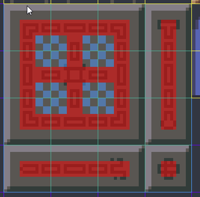
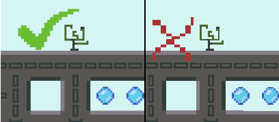

How do I do X in Godot/gdscript

offical docs: [here](https://docs.godotengine.org/en/stable)

[Reload the current scene:](#reload-the-current-scene)

[Generate random numbers:](#generate-random-numbers)

[Change the game speed:](#change-the-game-speed)

[Go into/out of fullscreen](#Go-into/out-of-fullscreen)

[Pause the game:](#pause-the-game)

[Get a reference to something from something else:](#get-a-reference-to-something-from-something-else)

[Make/Use a singleton (Script that is automatically instaciated and accessable by any other scripts regardless of scene)](#make/use-a-singleton-script-that-is-automatically-instaciated-and-accessable-by-any-other-scripts-regardless-of-scene)

[Make my pixel art not blurry](#make-my-pixel-art-not-blurry)

[Make tiles from an image](#make-tiles-from-an-image)

[Move a specific node not all the other stuff in the same place as it](#move-a-specific-node-not-all-the-other-stuff-in-the-same-place-as-it)

[Make autotiles work](#make-autotiles-work)

[Enable or disable part of an area or physics body](#enable-or-disable-part-of-an-area-or-physics-body)

[Make a control size itself realtive to the viewport](#make-a-control-size-itself-realtive-to-the-viewport)

[Open a FileDialog to save with a specific name already in the box](#open-a-filedialog-to-save-with-a-specific-name-already-in-the-box)

[Make a prefab](#make-a-prefab)

[Close the game](#close-the-game)

[Use scenes as prefabs](#use-scenes-as-prefabs)

[Change the font or font size used by UI elements](#change-the-font-or-font-size-used-by-ui-elements)

[Generate collision shapes in code](#generate-collision-shapes-in-code)

[Stop hitting phantom corners in a solid surface in a tilemap](#stop-hitting-phantom-corners-in-a-solid-surface-in-a-tilemap)

[Make paralax layers](#make-paralax-layers)

[How does all this UI stuff even work](#how-does-all-this-ui-stuff-even-work)

[Get or set "Theme Properties" (theme overrides) in code](#get-or-set-"theme-properties"-theme-overrides-in-code)

[Save stuff to disk/Read save files](#save-stuff-to-disk/read-save-files)

[Find resource files or files in the user filesystem](#find-resource-files-or-files-in-the-user-filesystem)

[Just get the mouse position](#just-get-the-mouse-position)

[Get a nicer scaling algorithm for pixel art (without forcing integer scale)](#get-a-nicer-scaling-algorithm-for-pixel-art-without-forcing-integer-scale)

## Reload the current scene
`get_tree().reload_current_scene()`

## Generate random numbers

`randf()` for a random float from 0 to 1 inclusive, and it's friend `rand_range(a, b)` which generates a random float in the range a to b again inclusive.

I just learned that it generates random numbers from 0 to 1 **inclusively** so be careful if you are using this to generate an int range with `floor()`
here's a method I created for generating a number that avoids the rare case of `randf()` returning 1 (and a function for an int range that goes with it):
```
func exclusive_randf() -> float:
	var r: = randf()
	return 0.0 if r == 1.0 else r

func random_int_range(start: int, end_exclusive: int) -> int:
	return start + int(floor(exclusive_randf() * (end_exclusive - start)))
```
`randomize()` call this once when you start to initialize the RNG with random seed, probably system time or whatever
use `seed(some_integer)` to set the RNG seed manually

You can create an instance of the `RandomNumberGenerator` class instead of using the global methods, 
but it has more stuff, notably you dont have to make your own `randi_range()` for ints in a range.

Godot also implements open simplex noise for noise stuff. (noise has a lot of advantages over RNG)
see the docs for the OpenSimplexNoise class <https://docs.godotengine.org/en/stable/classes/class_opensimplexnoise.html>

## Change the game speed
use `Engine.time_scale`
don't set this to 0 to pause if you want timers that are still able to run.
use the `get_tree().paused` property and set the Timer's `pause_mode` to `Process`

## Go into/out of fullscreen
`OS.window_fullscreen`

## Pause the game
use `get_tree().paused = true`
if you want things to still happen while paused set the Node's `pause_mode` to `Process`
the default pause mode is `Inherit` so child nodes will also still run

## Get a reference to something from something else
if theres behind the scenes code or data that you want accessable from everywhere, see "Make/Use a singleton"

for accessing things like the player, or just any specific ubiquitous object
The quick and dirty, but still fast and relatively safe way to do this is to add a Group to the node you want to find

e.g. for making the player findable by other stuff:
select the player's node in the tree
click the "Node" tab next to the inspector tab where signals are
click the "Groups" button
type "Player" into the textbox and click "Add"
to find the player from other nodes do something like:
```
var found_player = get_tree().get_nodes_in_group("Player")
if found_player:
    var player = found_player[0]
	# do stuff with player
```
something like this for finding nodes is useful to wrap in a utility function inside of a singleton for easy access from any script
so scripts can do something like
`Utility.get_player()`

## Make/Use a singleton (Script that is automatically instaciated and accessable by any other scripts regardless of scene)
Ok, first off **DO THIS**, singletons are just really handy for utility functions, game settings, and various scripts that handle behind the scenes stuff.

In the script editor window make a new script by selecting File -> New Script...
It should already be inheriting `Node`, select that if not
save it wherever makes sense (I usually put all my .gd scripts in a src/ directory)

put a bunch of useful stuff in the script. Utility functions, global variables (bad idea), 
global properties with getter/setter (slightly better idea), game settings, etc.

go to Project -> Project Settings -> AutoLoad
click the folder by "Path:" and select your script file
give it a name or use the one automatically filled in based on your file name
click "Add"

Now to access the stuff in this script from another script:
you can access the node by it's name directly e.q. with a singleton called Utility:
`Utility.do_things()`
or you can get it with:
`get_node("/root/Utility")`
but idk why you would do it that way unless you didn't read this first

more info: <https://docs.godotengine.org/en/stable/tutorials/scripting/singletons_autoload.html>

## Make my pixel art not blurry
click one of the image files in the file tree
click the import tab next to the scene tree tab
uncheck "Filter"
click the "Preset" button and click "Set as default for Texture"
click reimport to update this image
either delete all the existing .import files for your other images or manually fix them all in the import tab
new images will now already be non-filtered

See [Down here](#get-a-nicer-scaling-algorithm-for-pixel-art-(without-forcing-integer-scale)) for how to get a better result when resizing your window to an arbitrary resolution


## Make tiles from an image
<details>
	<summary>Click to expand</summary>

Note if your textures are filtered make sure your tiles have spacing between them so they dont bleed into each other
	
First create a tilemap node then in the inspector click the tile set arrow and click "new tileset"
when you want to edit the tileset just click the tileset in the inspector for the tilemap

in the tileset section that opens at the bottom by default:
click the + button to add your tiles image (I'd recommend having your tiles in 1 or a few images rather than one image per tile)
click the image in the list on the left to start making the tiles
click "new single tile" dont worry about the grid yet
click and drag a rectangle

now that you have a tile you can edit the snapping grid and seperation etc in the inspector on the right
use the little magnet button above the tiles to enable/disable the snapping
to edit the collisionbox of a tile first select it then click the collision button
click the "new rectangle" or "new polygon" button and draw the shape

the collision shapes are automatically created by the tilemap wherever you place the tiles so if you need to change the collision properties do it on the tilemap
you can set individual tiles to be one way collision in the inspector
</details>

## Move a specific node not all the other stuff in the same place as it
click the move tool up by the cursor icon at the top
switch back to the select tool to be able to select stuff by clicking it

## Make autotiles work
<details>
	<summary>Click to expand</summary>
	
Once you've drawn enough tiles to use for the autotiler you need to set up the bitmask to get them to work
click new auto tile
drag the region over all the tile variants
over in the inspector, switch the autotile mode to 3x3 minimal (I wouldn't bother with 2x2 unless its for something that is always at least 2 thick)
click on the bitmask button
click on the tiles to paint the bitmask, left click to set the bit to on (red)
right click to clear
shift left click to set the bit to ignore (blue checker)

if you dont want to make tons of tile variations (ignore internal corners) just use this pattern


if you're drawing autotiles and they look all broken it's probably because your brush is mirrored or rotated, hit the little paintbrush at the top right to reset the transform
</details>

## Enable or disable part of an area or physics body
you can disable collisionshape nodes to make the shape they hold stop interacting with stuff
but you have to call `collision_shape.set_deffered('disabled', true)`
instead of setting it directly

This is a good way to change the size of the player's physical body for example (having 2 collision shapes that you switch between)
just keep in mind it wont be changed until the next idle frame

## Make a control size itself realtive to the viewport
You can easily do this if it's the root node of the scene

Otherwise you can do this via gdscript by:
* Set it as a toplevel cavas item with `set_as_toplevel(true)`
* After doing that, update it's margins appropriately since they will be auto updated to keep its size the same

## Open a FileDialog to save with a specific name already in the box
First set the directory and file name you want with `current_path` or `current_dir` and `current_file`

Then call `popup()` (or `popup_centered()` or whichever version)

After calling popup call `deselect_items()`, it should now actually show your specified file name in the input box

## Make a prefab
use scenes

## Close the game
`get_tree().quit()`

## Use scenes as prefabs
TODO

## Change the font or font size used by UI elements
TODO

## Generate collision shapes in code
TODO

## Stop hitting phantom corners in a solid surface in a tilemap
quick and dirty fix: use a circle or capsule collider (not very good solution for platformer)
TODO

## Make paralax layers
TODO

## How does all this UI stuff even work
TODO

## Get or set "Theme Properties" (theme overrides) in code
a "theme property" is a named override of some type
the possible types are: color, constant, font, icon, shader, and stylebox
use the appropriate has and set method to check and add these via code (has_X_overrride, add_X_override)

to get the current value which is either an override or from the theme use get_X
e.g. to set a theme property called "panel" which is a stylebox use:
`add_stylebox_override("panel", new_panel)`
set it to null to disable the override:
`add_stylebox_override("panel", null)`
to get the current value:
`var cur_panel = get_stylebox("panel")`

## Save stuff to disk/Read save files
put files in the "user://" file system

## Find resource files or files in the user filesystem
Use the Directory class see docs for an example <https://docs.godotengine.org/en/stable/classes/class_directory.html>

## Just get the mouse position
get_viewport().get_mouse_position()

## Get a nicer scaling algorithm for pixel art (without forcing integer scale)
Scaling pixel art at a non-integer resolution isn't ideal but when you want to do it, you want consistent pixel sizes
You can see the distortion here in this image but it's very very obvious in motion


To acheive something not terrible we have to combine the benefits of nearest neighbor scaling and regular old bilinear filtering

I've made an example project that shows the implementation of both methods and compares it to just using the builtin scaling options
check it out [Here](https://cammymoop.itch.io/godot-double-viewport-scaling-demo)

<details>
  <summary>Explanation of how it works here (click to expand)</summary>

note:
Since we're going to be setting some viewport sizes manually, the aspect ratio from the window wont propogate down to the
viewport we're rendering to automatically.
You can still manually adjust your render resolution to fit the aspect of the window on a resize though.

### 2 viewport method: (good results, fake pixel res)
(Make sure all your pixely textures are imported without filtering)

First add a viewport to you scene and have all the pixely stuff as a child of that viewport
All of the children will now render to the viewport

Make the root of your scene a control node, and set it up to cover the whole screen (anchor left 0, top 0, right 1, bottom 1, all margins 0)

Make a TextureRect, or have your scene root be a texture rect, that also covers the whole screen.

This Texture rect will receive what our viewport is rendering which will be at a nice integer scale of our pixel resolution.
It will then scale itself to fit into the "regular" viewport that godot creates automatically.
And it will do it with some filtering so we can get the goldilocks zone of just a little blur.

Set it's `expand` property to true
and set the Stretch Mode to something that stretches, you probably want "Keep aspect centered" or "Keep aspect covered"
depending on if you want to crop in or have blank space when the aspect ratio is wrong.
(Make your viewport a child of this texture rect for ease of access and organization, DONT put it into a viewport container)

Set the viewport `size` in the inspector or its script to be your pixel resolution times an integer factor of at least 2
Set it's render taget -> v flip to on

The result can be larger than your screen, but importantly each pixel is now a NxN cluster of pixels that will look much
nicer when scaled to our actual window resolution

Make a script that runs when the scene loads and does this:
- set the viewport size override to the pixel resolution (now stuff will render into the viewport at the right size)
- set the viewport texture flag for filtering on scale e.g. `get_texture().flags = Texture.FLAG_FILTER`
- set the TextureRect's texture to the viewport texture

example script on the viewport which is a child of the TextureRect:
pixel resolution is 384x384 and the Viewports `size` is 1536x1536 (4x)
(tip: you can type `384*4` into the inspector and it will multiply for you)
```
extends Viewport

func _ready():
	set_size_override(true, Vector2(384, 384))
	set_size_override_stretch(true)
	
	get_texture().flags = Texture.FLAG_FILTER
	get_parent().texture = get_texture()
```

Since the first render is at a higher than pixel resolution you can move things less than 1 pixel and see the difference visually
This can be a good or bad thing. To eliminate it, you can use an addition viewport as described in the next section

### 3 viewport method: (game rendered at actual pixel resolution first)
Same as the 2 viewport method above but with 2 intermediate viewports

Add all your nodes to the first viewport. I'll call this WorldViewport. Set it's `size` to be your pixel resolution
Set it's render taget -> v flip to on

Add it's texture to a TextureRect (like above but without setting size overrides or the filter flag) I'll call this TextureRect1

Add TextureRect1 into a viewport I'll call this ScalerViewport
Make sure TextureRect1's anchors and margins are set up to fill the ScalerViewport
Set TextureRect1's `expand` to true and `stretch_mode` to anything that scales (I just use Keep Aspect Centered again, but it doesn't matter since we're always matching the aspect of our 2 viewports)

Set ScalerViewport's `size` to be some integer multiple of your pizel resolution
Set it's render taget -> v flip to on

Now put ScalerViewport into another TextureRect (TextureRect2)

Add ScalerViewport's texture to TextureRect2 this time with the filter flag set but **without** the size overrides

Make sure TextureRect2 is set up to fill its parent and is a scene root or inside a `Control` scene root

Setup the expand and stretch mode on TextureRect2 just like in the 2 viewport method

This method has similar looking results but the difference is that your first render is at your actual pixel resolution so it's impossible to render anything not aligned to the pixel grid
</details>


